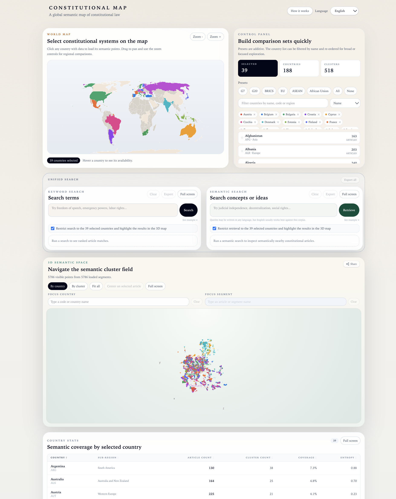
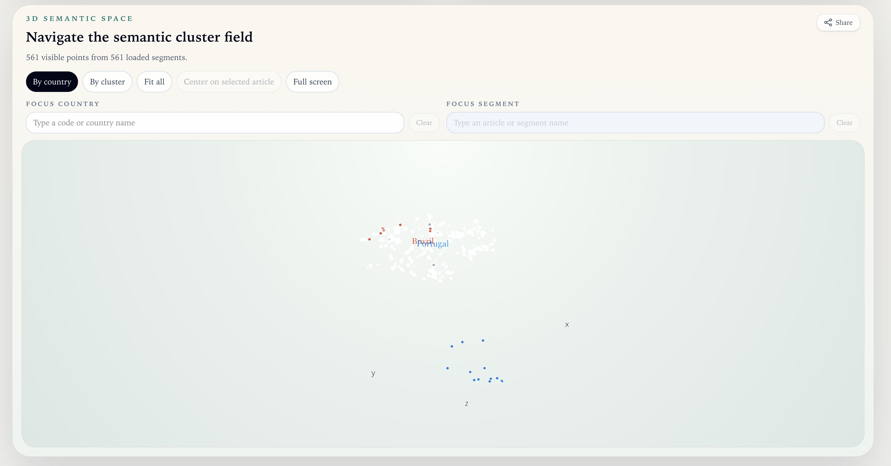
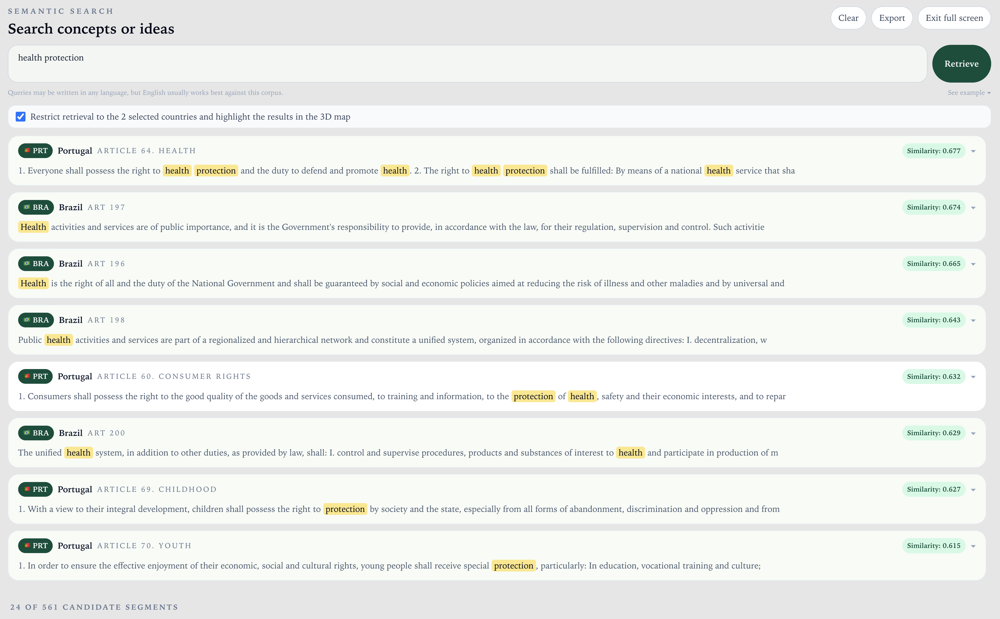
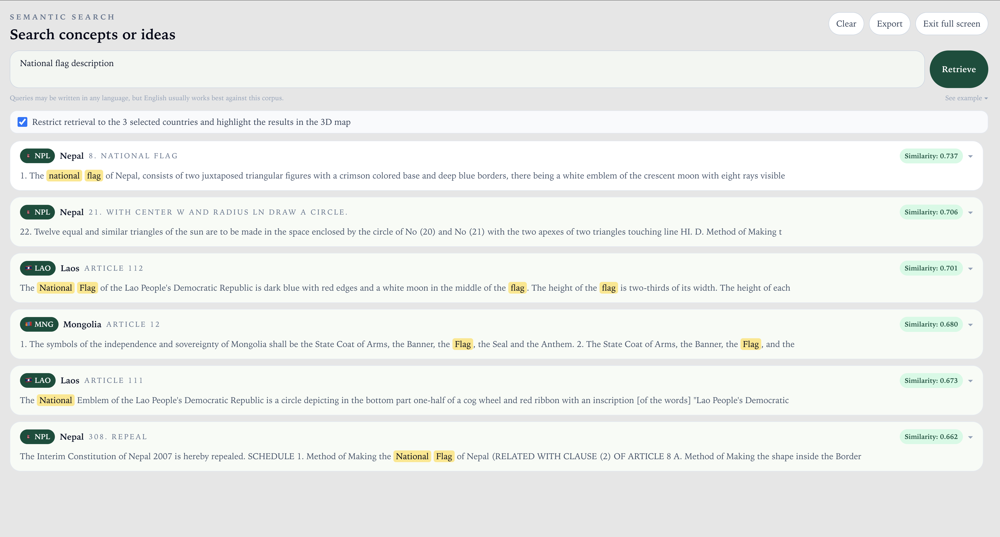
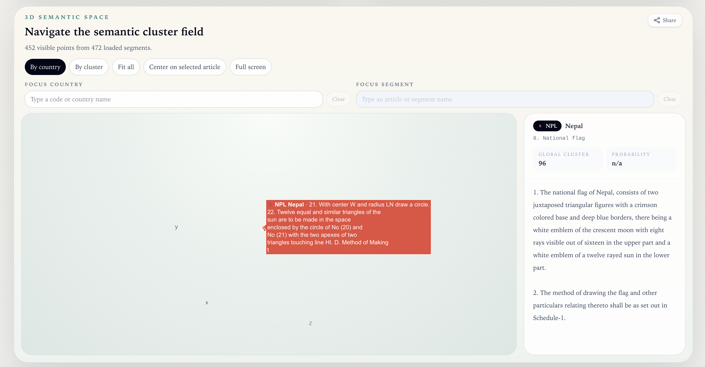

# Constitutional Map

Constitutional Map AI is an interactive semantic atlas of comparative constitutional law, featuring 189 constitutional systems, more than 30,000 legal segments, textual search, semantic search, and 3D visualization. The code is open source, and the constitutional texts are derived from the Constitute Project, in accordance with the applicable license.

**Live app → [constitutionalmap.ai](https://constitutionalmap.ai)**

## Motivation

I built this atlas after noticing a gap between utility and feasibility. Researchers and journalists often need to compare constitutions across countries, but existing tools either have steep learning curves or only allow keyword searches. By combining semantic embeddings with an interactive 3D view, we can jump to conceptually related passages even when wording differs. The minimum viable product (MVP) for this map was assembled in just two days, thanks to coding assistants that helped with the initial prototype and data pipeline. Although the MVP is simple, it shows how far we can push AI-assisted coding to build usable research tools quickly.

## Preview

<p align="center">
  
</p>

<p align="center">
  <a href="https://constitutionalmap.ai/media/3d-constitutional-map.mp4">
    
  </a>
</p>

<p align="center">
  <em>The overview image shows the product at a glance. Click it to watch the short 3D walkthrough hosted by the live app, or use the direct link: <a href="https://constitutionalmap.ai/media/3d-constitutional-map.mp4">3D Constitutional Map demo</a>.</em>
</p>

---

## What it does

Each point in the 3D view represents one constitutional segment (usually an article or equivalent legal unit). Points that are semantically similar — regardless of country — cluster together. This makes it possible to see, at a glance, which constitutional themes recur across legal traditions, which countries share similar language, and which articles are outliers in the global landscape.

Key capabilities:
- **World map selection** — click countries to load their constitutional segments
- **3D semantic space** — navigate the UMAP-projected embedding, coloured by country or by global cluster
- **Full-text search** — PostgreSQL `plainto_tsquery` across all 30 828 articles, ranked by relevance
- **Article detail** — click any point to read the original constitutional text
- **Country statistics** — article count, cluster count, semantic coverage and entropy per country, sortable by any column
- **Presets** — G7, G20, BRICS, EU, ASEAN, African Union, All
- **i18n** — English, Português, Español

---

## Examples

### Health Protection — Brazil and Portugal

This view shows that the leading semantic matches are the core health provisions themselves — Portugal's Article 64 and Brazil's Articles 196, 197, 198, and 200 — ranking at the top of the results and clustering closely in semantic space. Their proximity highlights strong constitutional alignment in treating health as a fundamental right and a state responsibility, while still allowing comparison of each system's institutional structure.

**→ [Open this view in the app](https://constitutionalmap.ai/share/ed9d0789-026d-43ce-a30c-051a106b39f3)**

<p align="center">
  
  
</p>

### National Flag — Nepal, Laos and Mongolia

This view shows that the semantic search for "national flag description" correctly ranks core constitutional provisions at the top — such as Nepal's Article 8 and Laos's Article 112 — while also surfacing closely related technical and symbolic clauses (e.g., Nepal's construction provisions and Mongolia's Article 12 on state symbols). The clustering reveals how constitutional texts combine descriptive, geometric, and symbolic elements in defining national identity, illustrating the platform's ability to capture both direct matches and structurally related provisions across jurisdictions.

**→ [Open this view in the app](https://constitutionalmap.ai/share/b550b1c9-a261-4bad-b399-f57553b9fafa)**

<p align="center">
  
  
</p>

---

## Repository structure

```
project-root/
│
├── pipeline/                   # Python data pipeline (M1 → M4.5)
│   ├── scripts/
│   │   ├── run_pipeline.py     # End-to-end orchestrator (M1 → M4.5)
│   │   ├── run_m1.py           # Scraper
│   │   ├── run_m2.py           # Segmenter
│   │   ├── run_m3.py           # Embedder
│   │   ├── run_m4.py           # Clusterer
│   │   └── run_m4_5.py         # Exporter (static JSON + Neon ingest)
│   │
│   ├── src/
│   │   ├── m1_scraper/         # Fetches constitutional texts from Constitute Project
│   │   ├── m2_segmenter/       # Splits texts into articles, validates segments
│   │   ├── m3_embedder/        # Generates Gemini embeddings, caches to Parquet
│   │   ├── m4_clusterer/       # UMAP (3D + 50D) + HDBSCAN global & per-country
│   │   ├── m4_5_exporter/      # Writes static JSON files + upserts to Neon
│   │   └── shared/             # Pydantic models, constants, ISO 3166 country codes
│   │
│   ├── tests/                  # Pytest unit tests for each module
│   └── pyproject.toml
│
├── app/                        # Next.js 16 web application
│   ├── app/
│   │   ├── [locale]/           # next-intl locale layout + main page
│   │   └── api/
│   │       ├── search/         # GET /api/search — full-text search via Neon
│   │       ├── article/        # GET /api/article — fetch full article text via Neon
│   │       └── compare/        # GET /api/compare — Jaccard similarity
│   │
│   ├── components/
│   │   ├── AtlasClient.tsx     # Root client component, state composition
│   │   ├── Canvas3D.tsx        # Plotly.js scatter3d + inline article detail
│   │   ├── WorldMap.tsx        # react-simple-maps SVG world map
│   │   ├── ControlPanel.tsx    # Country selection, presets, filters
│   │   ├── SearchPanel.tsx     # Full-text search UI
│   │   └── StatsPanel.tsx      # Sortable country statistics table
│   │
│   ├── lib/                    # Shared utilities (colors, search, Neon client, types)
│   ├── hooks/                  # useCountryData — concurrent country JSON fetching
│   ├── stores/                 # Zustand app store
│   ├── messages/               # i18n strings (en.json, pt.json, es.json)
│   └── public/data/
│       ├── index.json          # Country index (193 entries, stats per country)
│       ├── clusters.json       # Global cluster summaries
│       └── countries/          # Per-country point JSON (193 files, snippets + coordinates)
│
├── .env.example                # Required environment variables
├── LICENSE.md                  # MIT (code) + CC BY-NC 3.0 (constitutional data)
└── README.md
```

---

## Pipeline overview

```
M1 Scraper     →  fetch constitutional texts from constituteproject.org
M2 Segmenter   →  split into articles, validate, write CSV
M3 Embedder    →  Google Gemini gemini-embedding-001 (768D), cache to Parquet
M4 Clusterer   →  UMAP 50D (clustering) + 3D (viz), HDBSCAN global + per-country
M4.5 Exporter  →  static JSON for CDN + upsert to Neon PostgreSQL
```

The generated `app/public/data/` is committed to the repository and served directly via CDN. Full article texts stay behind the Neon-backed API, which also powers full-text search.

---

## Tech stack

| Layer | Technology |
|---|---|
| Pipeline | Python 3.12, umap-learn, hdbscan, google-generativeai, pandas, psycopg2 |
| Embeddings | Google Gemini `gemini-embedding-001` (768D) |
| Database | Neon (serverless PostgreSQL) — full-text search with GIN index |
| Web app | Next.js 16, TypeScript, Tailwind CSS |
| 3D viz | Plotly.js (`plotly.js-dist-min` + `react-plotly.js` factory) |
| World map | react-simple-maps |
| State | Zustand |
| i18n | next-intl (EN / PT / ES) |
| Hosting | Vercel |

---

## Getting started

### Prerequisites

- Python 3.12+ with [uv](https://github.com/astral-sh/uv)
- Node.js 20+
- A [Neon](https://neon.tech) database
- A [Google AI Studio](https://aistudio.google.com) API key (for embeddings)

### Environment variables

Copy `.env.example` to `.env` and fill in:

```bash
NEON_DATABASE_URL=postgresql://...
GEMINI_API_KEY=...
```

For the web app, also create `app/.env.local`:

```bash
NEON_DATABASE_URL=postgresql://...
```

### Run the pipeline

```bash
cd pipeline
uv sync
uv run python scripts/run_pipeline.py   # full M1 → M4.5
# or step by step:
uv run python scripts/run_m1.py
uv run python scripts/run_m2.py
uv run python scripts/run_m3.py
uv run python scripts/run_m4.py
uv run python scripts/run_m4_5.py
```

### Run the web app

```bash
cd app
npm install
npm run dev      # http://localhost:3000
```

---

## Data source & license

See [LICENSE.md](LICENSE.md).

Constitutional texts are sourced from the [Constitute Project](https://www.constituteproject.org/) under CC BY-NC 3.0. The pipeline code and web application are released under the MIT License.

---

## Support

This project runs on AI embeddings and cloud servers. If you find it useful, consider sponsoring a month of infrastructure costs at **[buymeacoffee.com/Joaoli13](https://buymeacoffee.com/Joaoli13)**.
